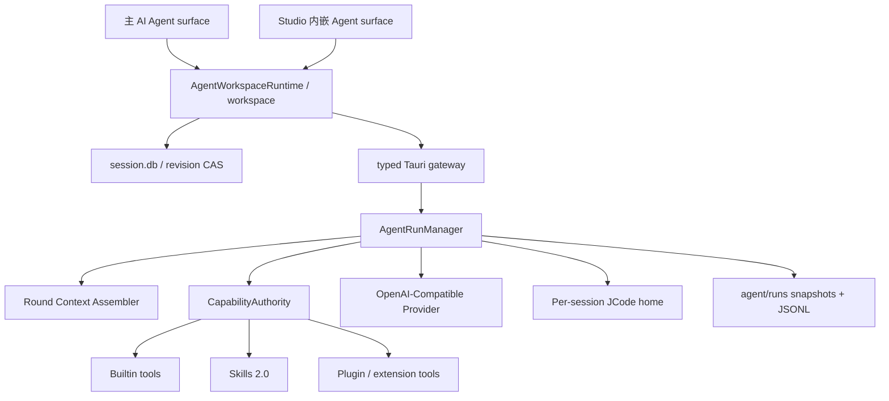

# AI Agent 运行时架构

本文记录 DRPA Next 内置 RPAZ Agent 与 JCode 开发者 Agent 的当前实现约束。重点不是提示词，而是会话、运行、上下文、工具和外部进程的所有权。任何新增 Agent 能力都应先明确归属，再接入 UI。

## 1. 核心不变量

1. `session.db` 是会话正文的唯一持久化事实源；Zustand 只保存界面偏好和轻量索引。
2. 同一工作区只创建一个 `AgentWorkspaceRuntime`，多个 Agent 页面只是 surface，不各自持有会话正文或运行状态。
3. 同一会话同一时间最多有一个活动运行；切换页面不会释放运行，也不会把输出写入另一个会话。
4. Rust Host 是工具能力、参数校验、运行预算和路径边界的最终裁决者，前端开关不是权限边界。
5. 每个 model round 都重新组装 provider 上下文；压缩只作用于投影，不修改完整会话历史。
6. 取消、超时和流解析失败必须沿同一个 `AgentRunControl` 传播到 Provider、Python、文档 worker、Skill 和 JCode 子进程。
7. 失败不是删除事件：部分正文、Action/Observation、重试、上下文检查点和错误必须先写入 `session.db`，再向用户暴露恢复入口。
8. 自动重试只覆盖可判定为暂时性的 Provider 请求；可能产生副作用的工具和外部进程不得整轮盲目重放。

## 2. 组件与所有权



### 前端 `AgentWorkspaceRuntime`

- 按 `workspaceId` 缓存单例。
- 一次性装载和迁移会话索引，正文按需读取。
- 对同一会话的并发读取去重，保存操作串行化。
- 删除会话后写入 tombstone，旧异步保存结果不得复活该会话。
- 为每个 surface 分别保存当前会话与输入草稿；主页面和 Studio 内嵌页面互不抢选中状态。
- 为每个会话维护一个共享运行投影。流式增量使用 `requestAnimationFrame` 合批，多个 surface 观察同一份内容、工具时间线和状态。

### Rust `AgentRunManager`

- 以 `requestId` 管理运行，以 `sessionId` 发放独占租约。
- 状态机：`running -> cancelling -> cancelled`，或 `running -> completed/failed`。
- 事件带单调递增序号，保存 `started`、`roundStarted`、`contextAssembled`、`delta`、`tool`、`completed`、`failed`、`cancelled`。
- 活动运行保存在内存；快照和追加式事件日志保存在工作区 `agent/runs/`，供诊断读取。
- `cancel_agent_run` 只设置一次统一取消信号；各执行适配器负责中断或终止自己持有的子进程。
- 完成路径必须释放会话租约，包括 Provider 错误、工具错误、超时、显式取消和流解析错误。

## 3. 会话一致性

会话表使用单调递增的 `revision`。保存正文时执行 compare-and-swap：调用方必须携带其读取到的 revision，Host 只在 revision 仍匹配时更新并返回新 revision。

这解决以下竞态：

- 主 Agent 页面载入完整正文后，Studio 内嵌页面拿到摘要并覆盖正文。
- 编辑后的消息被较慢的旧请求覆盖。
- 删除会话后，未完成的保存又把该会话插回数据库。
- 工作区切换期间把 A 工作区的响应写入 B 工作区。

删除会话采用跨存储补偿事务：先暂存附件/产物目录，再删除 SQLite 记录；数据库失败则恢复目录，成功后提交文件清理，并清除 JCode home 与 session index。

## 4. 运行预算与上下文

单次 conversation turn 由多个 model round 构成。当前预算均由 UI 配置、Host 再次夹紧：

| 预算 | 默认值 | Host 范围 |
| --- | ---: | ---: |
| model rounds | 64 | 1–256 |
| tool calls | 128 | 1–4096 |
| wall time | 900 秒 | 10–86400 秒 |
| Python 单次执行 | 300 秒 | 1–86400 秒 |

每轮执行顺序：

1. 检查取消和 wall-clock deadline。
2. 根据 `CapabilityAuthority` 生成本轮可见工具定义。
3. 计算工具 schema 占用；工具定义过大时按预算裁剪并记录 `omittedTools`。
4. 将 assistant tool-call 与对应 tool result 作为不可分割组装单元。
5. 从最新消息向前保留连续上下文，始终保留 system 与最新用户任务。
6. 所有开头的固定 system 上下文（策略、项目上下文、结构化检查点）作为不可裁剪前缀；较早的本轮工具组转换成有大小上限的证据摘要，而不是只记录“已省略”。
7. 发出 `contextAssembled` 事件，记录估算 token、保留/省略消息数和工具数。
8. 调用 Provider，执行并记录工具结果，然后在下一轮重新核算。

跨 Turn 的历史超过消息数或 token 预算时，Harness 生成结构化 `contextCheckpoint`，保留用户目标与约束、决定、文件/工具证据、失败原因、未完成事项和下一步。检查点携带覆盖消息数与 SHA-256 前缀摘要；只有原始历史前缀完全匹配时才复用。压缩模型不可用时退化为有界原始历史尾部，不会因此清空会话。检查点与每轮压缩/重试元数据随 assistant 消息写入 `session.db`。

运行与界面共享同一套有序事件语义：一次用户请求是 `Turn`，每次模型请求是 `Step`，工具请求是 `Action`，工具返回是 `Observation`。工具事件携带跨步骤稳定的 `ordinal`、所属 `round`、脱敏后的输入、状态和耗时；`running` 到 `completed/failed` 必须按 `callId` 原位更新，不能重新追加导致顺序跳动。历史会话只持久化最终 Observation，流式运行同时投影正在执行的 Action。

达到 rounds、tool calls 或 wall time 时，不把预算耗尽伪装成普通错误。运行关闭工具定义，再请求一次最终总结；结果通过 `stopReason`、`rounds` 和 `toolCalls` 说明实际停止原因与消耗。

内置 RPAZ Agent 在实际 dispatch 边界维护单轮命令幂等账本。连续出现相同工具名与规范化参数时，只执行第一次调用，后续调用复用首次 `ToolResult`；任意不同工具调用都会结束这段连续复用。工具上下文使用结构化完成信封，明确给出 `status`、`executionPerformed`、`emptyOutput`、`result` 与可选 `reusedFromCallId`。因此 exit code 为 0 且 stdout/stderr 为空仍是已完成结果，而不是再次执行的依据。

完整工具 stdout、HTML、凭据和大文件不进入下一轮。持久 assistant 消息只保存工具摘要；凭据读取和文档正文类工具使用脱敏摘要。

## 5. 工具能力与权限

所有工具先转换成规范化 `ToolDescriptor`：

- `name`、`description`、JSON Schema 参数；
- `origin`：builtin、host、skill、plugin、extension、jcode；
- `sensitivity`：普通读写、凭据读写等；
- 是否允许把原始结果写入持久会话。

`CapabilityAuthority` 在两个位置执行相同决策：

1. 工具定义发送给模型之前过滤；
2. 工具实际 dispatch 之前再次判断。

Host 对参数执行 required、类型、enum、数组元素、嵌套对象和 `additionalProperties` 校验。插件或 Skill 的自述 schema 不会绕开 Host 校验。

当前显式能力包括数据库读取/连接、文件读取、知识库、文档读写/转换、项目写入、Python、工作区写入、扩展、浏览器、RPAZ 运行、运行记录、凭据读取和凭据写入。凭据读写是两个独立能力。

结构化长期记忆使用 `agent_remember` 追加到 `agent/memory/events.jsonl`，并把可读投影追加到 `MEMORY.md`。`agent_write_memory` 仅用于用户明确要求整体重写记忆文件的场景。

## 6. Provider 适配

RPAZ Agent 和 Local Dify 共用 `provider.rs`：

- 统一 `/v1` 与 `/chat/completions` endpoint 规范化；
- 统一 OpenAI-compatible 请求头、分阶段网络时限和连接池；
- 统一普通 JSON 与 SSE 增量解析；
- 统一配置、HTTP、协议、取消和超时错误分类；
- Provider 调用在阻塞工作线程执行，协调线程轮询 `AgentRunControl`，因此 UI 取消不等待长 HTTP 超时。
- 408、409、425、429、5xx 和连接/超时类错误最多尝试 4 次，使用指数退避与抖动；401、403、参数错误和响应协议错误立即失败。
- 流式请求在重试前发出 `contentReplace` 回滚该次未完成增量，避免重连后把相同片段重复拼接。重试事件进入运行日志和会话轨迹。

Provider 的连接、发送和首个响应阶段使用握手时限；响应正文使用当前 Agent Run 的剩余预算。固定握手时限不得作为整个 SSE 的 `global` 时限，否则持续输出的长任务会在固定秒数处被误杀。MiniMax OpenAI-compatible 请求启用 `reasoning_split`，解析器保留 `reasoning_content`/`reasoning_details` 供工具回合续接，但只向 `Delta` 和最终 Markdown 投影可见答案；`<think>` 与 `<mm:think>` 是兼容兜底，不进入正文。

JCode 使用相同的请求 profile 生成 session 配置，但进程协议仍由 JCode adapter 负责。MiniMax profile 同样写入 `reasoning_split = true`，NDJSON adapter 再执行一次可见内容分流。Provider key 只通过进程环境传入，不写入 JCode 配置文件或运行日志。

桌面包按目标平台携带 JCode：Windows 为 `$RESOURCES/jcode/jcode.exe`，Linux/UOS 为 `$RESOURCES/jcode/jcode`。Linux 资源在打包前由固定版本与 SHA-256 的下载器落盘，AppImage、普通 deb 和 UOS deb 都必须验证文件存在且可执行；运行时缺失提示也按当前平台显示文件名。

DRPA 启动 JCode 时固定关闭其默认 `auto-poke`，避免未完成 Todo 在 Host 预算之外自动开启额外回合。Adapter 会累计 NDJSON 的 `tool_input/tool_exec/tool_done`，执行 DRPA 的工具调用上限，并在相邻的同名同参 Action 连续返回相同 Observation 后终止 sidecar，记录 `repeated-tool-call`；不同操作或结果变化都视为取得进展并重置检测链，允许正常轮询和修改后复查。

JCode 一旦报告 session id 就更新 DRPA 的可恢复索引；即使进程随后 502、退出或返回空答复，下一次“从失败处继续”仍使用该 session，而不是重新创建一个失忆的 JCode 进程。DRPA 不自动重放整个 JCode 进程，因为其中可能已经执行写文件或命令等副作用操作。

JCode 的命令工具在 sidecar 内执行，单靠 NDJSON adapter 只能在执行后观察结果。DRPA 因此为每次会话生成隔离的 `pre_tool`/`post_tool`/`turn_end`/`session_end` hook：`pre_tool` 在第二次进程启动前按规范化参数和状态屏障判重，`post_tool` 记录成功或失败；只读工具不改变屏障，写文件或其他状态变更工具允许命令再次执行，失败命令也允许重试。hook 状态只保存在当前 DRPA 运行的 JCode home，进入新 turn 或结束会话时清理。

## 7. 附件、产物与外部进程

- 对话打开时从 session 附件目录恢复索引，不依赖 React 内存。
- 附件支持单独删除；删除会话同时清理附件、转换产物和 JCode home。
- 文档 worker、Skill Python、RPAZ Python、Chrome Bridge 和 JCode 都接收同一运行控制器。
- 外部进程输出有大小上限；取消、超时、输出超限、无效 NDJSON 或父进程提前退出时终止受管进程树。
- JCode 不再使用全局运行锁。不同会话可并发，同一会话由 Run Manager 租约串行。
- `AgentBrowserManager` 为每个会话持久分配独立调试端口、Chrome profile 和产物目录；RPAZ 与 JCode 在同一会话内复用该目标，不再争用固定 `9222` 和全局 profile。
- JCode MCP 通过带会话作用域的 Host Bridge 暴露 `document_read/create/convert`，因此 UI 附件提示在两种 Agent 模式下都对应真实工具；所选 Skills、工作区 AGENTS 和记忆也会进入 JCode 上下文。

## 8. 回归测试门槛

涉及 Agent 的提交至少执行：

```powershell
cd G:\workspace\drpa
cargo test --lib

cd G:\workspace\drpa\apps\desktop
npm run typecheck
npm test -- src/features/agent/AgentWorkspaceRuntime.test.ts
npm test -- src/app/App.test.tsx
npm run build
```

关键回归用例包括：

- 两个 Agent surface 同时挂载时，摘要不会覆盖完整正文。
- stale revision 保存失败，已删除会话不会复活。
- 同会话运行互斥，不同会话 JCode 不受全局锁影响。
- 取消信号能被 Provider 和子进程观察。
- 首个流事件出现后，即使总流时长超过握手时限，Provider 仍持续接收直至 Run 预算结束。
- MiniMax 累积式 reasoning/content 快照不会重复，推理字段和分片 `<think>` 标签不会进入正文事件。
- 成功但无输出的命令只真实执行一次；模型重复提交相同调用时收到明确的已完成结果。
- JCode 在只读工具前后仍拦截同状态屏障内的重复命令；文件变更、新 turn 与失败结果会解除对应判重。
- 上下文裁剪不会拆开 tool-call/tool-result 组。
- 工具 schema 计入 token 预算，禁用工具既不可见也不可执行。
- 暂时性 Provider 错误会退避重试，认证/参数错误不会重试；失败后部分正文、工具顺序、错误和检查点仍可从会话恢复。
- 上下文检查点只对完全匹配的历史前缀生效；修改旧消息后必须失效并重建。
- 附件可在重启后恢复，删除会话时文件和索引一致清理。

## 9. 后续扩展边界

持久 Jupyter kernel、运行 checkpoint 恢复、浏览器 session 级快照和 Provider capability probing 仍应作为独立服务接入。它们必须复用现有 Run Manager、CapabilityAuthority、事件日志和会话生命周期，不再在 React 页面或单个工具函数里新建第二套状态机。
