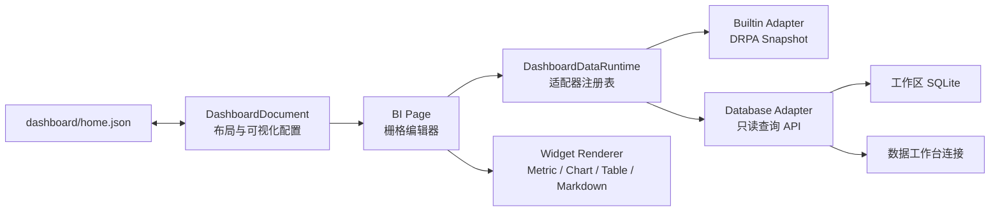

# BI 主页架构

> 交互更新：编辑模式中的组件使用指针事件驱动栅格拖拽。目标位置被占用时，布局引擎会优先把被碰撞组件移动到拖动组件腾出的空位，再进行最近空位查找和纵向压缩；响应式列投影同样保证组件不重叠。位置变化通过 FLIP 动画呈现，并遵循系统的减少动态效果设置。

## 1. 目标

DRPA 的总览页不是固定报表，而是工作区级低代码 BI 画布。它同时消费两类数据：

1. DRPA 内置数据集，例如工作区指标、运行记录、运行状态和 RPAZ 包；
2. 数据工作台管理的工作区 SQLite、外部 SQLite、Excel、PostgreSQL 和 MySQL 数据源。

仪表盘定义、数据访问与图形渲染相互独立。新增数据库驱动、图表类型或数据转换时，不需要改写整个主页。

## 2. 分层



### 2.1 定义层

`DashboardDocument` 只描述：

- 仪表盘列表与当前主页；
- 12 列等基础栅格参数；
- 组件类型和栅格位置；
- 数据源引用与只读 SQL；
- 字段映射、数字格式、颜色和刷新周期。

定义中不存查询结果，也不存数据库密码。每个工作区独立保存到 `dashboard/home.json`。Rust Host 对数量、字段长度、栅格边界、数据源和 SQL 大小进行验证，并使用临时文件与备份完成替换。

### 2.2 数据层

`DashboardDataRuntime` 是前端数据适配器注册表。适配器统一输出：

```ts
interface DashboardDataset {
  columns: string[];
  rows: Array<Record<string, unknown>>;
  durationMs: number;
  truncated: boolean;
}
```

当前适配器：

- `builtin`：把 `WorkspaceSnapshot` 转换为表格式记录；
- `database`：调用 `execute_dashboard_database_query`，复用数据工作台连接。

后续可注册 HTTP、Parquet、插件或 RPAZ 产物适配器。组件渲染器只依赖 `DashboardDataset`，不感知连接方式。

数据库 BI 查询强制使用 `database::agent_execute_read_only_query`。SQLite 同时检查 prepared statement 的 `readonly()`；PostgreSQL/MySQL 在只读事务中执行并回滚。远程密码只存在当前前端会话，不写入仪表盘定义。

### 2.3 展示层

组件渲染器按照 `kind` 分派：

- `metric`：单值指标；
- `line`、`bar`、`pie`：轻量 SVG/CSS 图表；
- `table`：滚动结果表；
- `markdown`：文字、口径和结论。

展示层不直接调用 Gateway。加载、错误、截断和刷新状态由 BI Page 统一管理。

## 3. 响应式栅格

持久化布局使用稳定的基础列数，默认 12 列。运行时根据画布宽度投影为：

- 宽屏：基础列数；
- 中等宽度：最多 8 列；
- 窄屏：最多 4 列。

投影只影响显示，不改写用户保存的基础布局。编辑模式支持拖放位置和右下角缩放；发生碰撞时，目标组件向下寻找空闲栅格。

## 4. 扩展约定

### 新增数据适配器

1. 扩展 `DashboardDataSource` 联合类型；
2. 实现 `DashboardDataAdapter`；
3. 向 `dashboardRuntime` 注册；
4. 在 Rust 验证器中允许对应来源；
5. 增加适配器到统一 Dataset 的测试。

### 新增可视化组件

1. 扩展 `DashboardWidgetKind`；
2. 在 `DashboardWidgetView` 增加纯渲染分支；
3. 在组件面板和属性面板暴露配置；
4. 为默认尺寸、最小尺寸和字段映射增加测试。

## 5. 数据边界

- 仪表盘数据库查询只读；
- 查询仍受数据工作台的行数、单元格和总字节限制；
- 密码不持久化；
- Markdown 不执行 HTML 或脚本；
- 仪表盘配置按工作区隔离并参与工作区数据备份。
