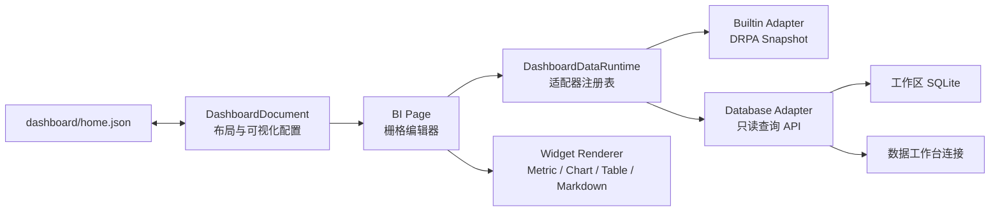

# BI 主页架构

> 交互更新：组件数组顺序是布局的唯一排序来源。拖动只改变组件在线性序列中的插入位置，统一装箱器再依据顺序与每张卡片的 `w/h` 从左到右、从上到下重新编排。拖动期间实时预览完整编排，松手时一次提交。响应式投影沿用同一顺序与装箱规则，并结合组件类型的最小可读宽度重新排布。位置变化使用 FLIP 动画，并遵循系统的减少动态效果设置。

## 1. 目标

DRPA 的总览页不是固定报表，而是工作区级低代码 BI 画布。它同时消费两类数据：

1. DRPA 内置数据集，例如工作区指标、运行记录、运行状态和 RPAZ 包；
2. 数据工作台管理的工作区 SQLite、外部 SQLite、Excel、PostgreSQL 和 MySQL 数据源。

仪表盘定义、数据访问与图形渲染相互独立。新增数据库驱动、图表类型或数据转换时，不需要改写整个主页。

## 2. 分层



### 2.1 定义层

`DashboardDocument` 只描述：

- 仪表盘列表与当前主页；
- 12 列等基础栅格参数；
- 组件类型和栅格位置；
- 数据源引用与只读 SQL；
- 字段映射、数字格式、颜色和刷新周期。

定义中不存查询结果，也不存数据库密码。每个工作区独立保存到 `dashboard/home.json`。Rust Host 对数量、字段长度、栅格边界、数据源和 SQL 大小进行验证，并使用临时文件与备份完成替换。

### 2.2 数据层

`DashboardDataRuntime` 是前端数据适配器注册表。适配器统一输出：

```ts
interface DashboardDataset {
  columns: string[];
  rows: Array<Record<string, unknown>>;
  durationMs: number;
  truncated: boolean;
}
```

当前适配器：

- `builtin`：把 `WorkspaceSnapshot` 转换为表格式记录；
- `database`：调用 `execute_dashboard_database_query`，复用数据工作台连接。

后续可注册 HTTP、Parquet、插件或 RPAZ 产物适配器。组件渲染器只依赖 `DashboardDataset`，不感知连接方式。

数据库 BI 查询强制使用 `database::agent_execute_read_only_query`。SQLite 同时检查 prepared statement 的 `readonly()`；PostgreSQL/MySQL 在只读事务中执行并回滚。远程密码只存在当前前端会话，不写入仪表盘定义。

### 2.3 展示层

组件渲染器按照 `kind` 分派：

- `metric`：单值指标；
- `line`、`bar`、`pie`：轻量 SVG/CSS 图表；
- `table`：滚动结果表；
- `markdown`：文字、口径和结论。

展示层不直接调用 Gateway。加载、错误、截断和刷新状态由 BI Page 统一管理。

## 3. 响应式栅格

持久化布局使用稳定的基础列数，默认 12 列。运行时根据画布宽度投影为：

- 宽屏：基础列数；
- 中等宽度：最多 8 列；
- 窄屏：最多 4 列。

投影只影响显示，不改写用户保存的基础布局。横向位置和宽度不再分别取整，而是投影 `left` / `right` 两条共享边界；相邻组件在不同断点下仍共享同一条边界，不会出现位置已经缩放、宽度仍停留在另一档的情况。

### 3.1 可视化构建工作区

编辑模式使用“组件/数据源左栏 + 中央响应式画布 + 右侧属性栏”的三栏结构。组件栏支持搜索并直接创建指标、图表、表格和 Markdown；数据源栏可以从 DRPA 内置数据集、工作区 SQLite 或数据工作台连接生成已绑定的数据组件。中央画布可以强制预览自动、桌面、平板和手机列数，预览切换不改写持久化布局。

这一信息架构参考了 ToolJet 的应用构建器思路，但实现完全基于 DRPA 既有 React 栅格、数据适配器与工作区存储。ToolJet 采用 AGPL-3.0，DRPA 不复制或链接其源码，避免把 AGPL 许可传播到 MIT 主程序。

窄画布还会应用组件级最小可读宽度：指标、饼图和 Markdown 至少占 2 列，折线图、柱状图和表格占满 4 列画布。组件自身使用 CSS Container Queries 响应实际卡片宽度，而不是只依据应用窗口宽度；标题元数据、指标字号、饼图图例和图表说明会在卡片变窄时逐级简化。

编辑交互遵循以下不变量：

1. `widgets[]` 的元素次序表示稳定排序关系，栅格坐标是该顺序的派生结果；
2. 指针位置只用于选择新的插入序号，不再表示要与某一张卡片交换；
3. 每次排序、增加、删除、缩放或列数变化后，统一装箱器依据卡片宽高重新生成全部坐标；
4. 装箱游标单向按行推进，保证数组顺序与视觉上的从左到右、从上到下顺序一致；
5. 拖动期间在内存中计算候选顺序和完整布局，其他卡片即时让位并使用 FLIP 动画过渡；
6. 松手时只保存最终顺序与布局一次，取消拖动则完整恢复；
7. 旧版本产生的非单调坐标会先按现有视觉位置归一化排序，再进入新的顺序驱动模型。

响应式视图可能为了最小可读宽度把组件临时放到不同的显示坐标，因此拖动坐标使用“显示位置增量 → 基础栅格增量”换算，而不是把显示坐标直接写回基础布局。只按下再松开不会改写保存位置。

## 4. 扩展约定

### 新增数据适配器

1. 扩展 `DashboardDataSource` 联合类型；
2. 实现 `DashboardDataAdapter`；
3. 向 `dashboardRuntime` 注册；
4. 在 Rust 验证器中允许对应来源；
5. 增加适配器到统一 Dataset 的测试。

### 新增可视化组件

1. 扩展 `DashboardWidgetKind`；
2. 在 `DashboardWidgetView` 增加纯渲染分支；
3. 在组件面板和属性面板暴露配置；
4. 为默认尺寸、最小尺寸和字段映射增加测试。

## 5. 数据边界

- 仪表盘数据库查询只读；
- 查询仍受数据工作台的行数、单元格和总字节限制；
- 密码不持久化；
- Markdown 不执行 HTML 或脚本；
- 仪表盘配置按工作区隔离并参与工作区数据备份。
