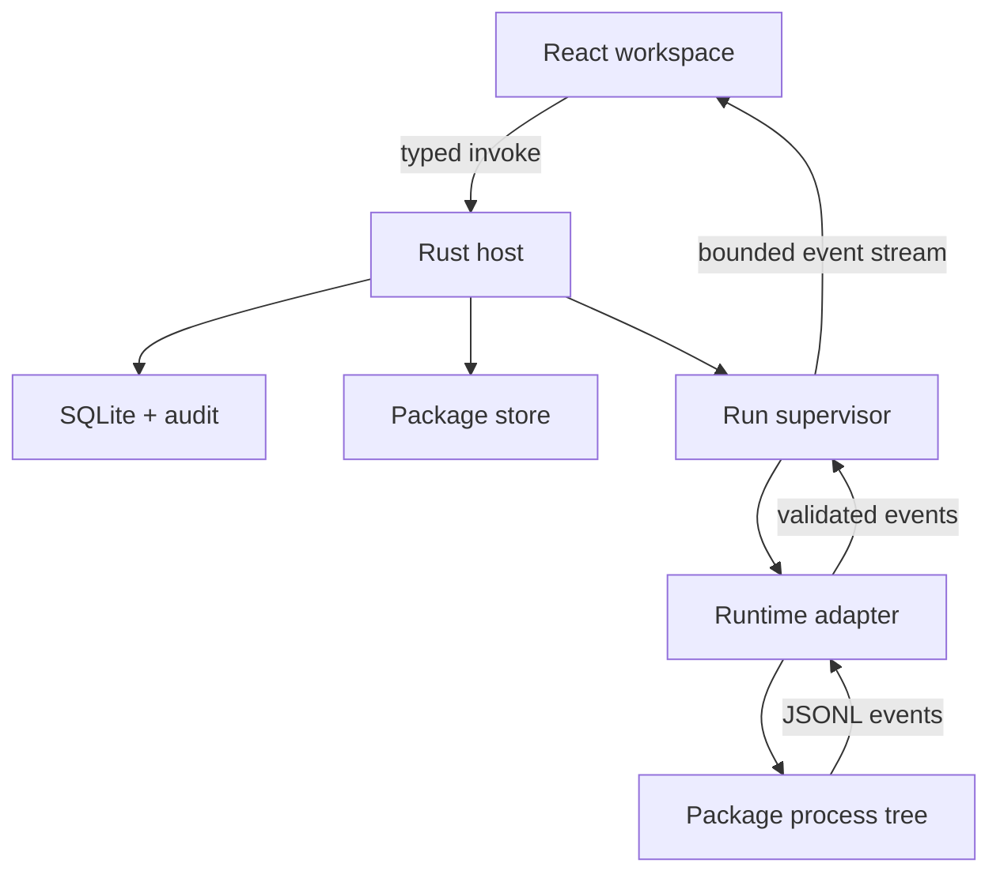

# DRPA Next architecture

## 1. Product definition

DRPA Next is not a low-code designer and not merely a Python script launcher. It is a local-first control plane for executable code packages.

The core user promise is:

> Install one trusted desktop application, then safely install, configure, run, observe, update, and audit many automation packages.

The initial market is Python and DrissionPage automation, but the domain model must not assume that every package is Python or browser automation.

## 2. Product capabilities

| Domain | First release | Extension path |
| --- | --- | --- |
| Package library | Install, verify, inspect, version, remove | Private registries, channels, signing policy |
| Task profiles | Typed parameters, secret references, reusable profiles | Team templates and policy inheritance |
| Runs | Concurrent execution, logs, progress, artifacts, cancellation | Queues, schedules, remote workers |
| Runtime center | Python 3.11 runtime and per-lock environments | Node, native command, WASI adapters |
| Security | Trust prompts, checksums, capability declarations, redacted history | Package signing, organization policy, sandbox backends |
| Observability | Structured event stream and SQLite history | Export, alerts, OpenTelemetry bridge |
| Authoring | Manifest validation and package diagnostics | SDK, recorder, package studio |

## 3. Technology stack

### Desktop shell

- **Tauri 2** for Windows, macOS, and Linux packaging.
- **Rust** for privileged host operations, process supervision, filesystem policy, package verification, and persistence.
- Tauri capabilities expose a deliberately small command surface to the webview.

Tauri is chosen over Electron because DRPA needs a native host control plane and should not ship a second browser runtime. It is chosen over keeping PySide6 because the new UI requires a mature component/testing ecosystem and a strict separation between presentation and host authority.

### Frontend

- React 19 and TypeScript.
- Vite 8 for development and production bundling.
- CSS custom properties as the canonical design-token format.
- Lucide icons, with icons always paired with accessible labels or tooltips where meaning is not obvious.
- Zustand for small client-side interaction state. Server/host state remains behind typed gateway functions.
- TanStack Virtual for long log streams and large package/run lists.
- Vitest and Testing Library for deterministic component tests.

The frontend must also run in a normal browser with a mock gateway. This keeps UI development fast and prevents every component test from requiring Rust or a desktop webview.

### Host core

Rust is split into domain-oriented crates:

```text
crates/drpa-protocol   Shared DTOs and event schema
crates/drpa-package    Manifest, archive, checksum, signature and install transaction
crates/drpa-runtime    RuntimeAdapter trait and environment resolution
crates/drpa-store      SQLite repositories and migrations
crates/drpa-host       Application services and Tauri-facing facade
```

No frontend component may access SQLite, spawn a process, or choose arbitrary filesystem paths directly.

### Runtime adapters

The host talks to runtimes through a versioned JSON Lines protocol.

```text
Host -> adapter: initialize, start, cancel, shutdown
Adapter -> host: ready, log, progress, artifact, warning, error, completed
```

Python is packaged as a platform-specific sidecar/runtime. Package environments are content-addressed by runtime version plus lock digest. Packages never mutate the desktop application's own environment.

## 4. Process model



The UI is not a security boundary. The Rust host validates every request again.

## 5. Package model v2

The existing `.rpaz` archive remains importable. New packages use the same extension with `schema: 2` in `manifest.yaml`.

```yaml
schema: 2
id: com.example.invoice-downloader
name: Invoice Downloader
version: 2.1.0
entrypoint:
  runtime: python
  module: main.py
  callable: main
runtime:
  python: "3.11.*"
  lock: requirements.lock
capabilities:
  network:
    allow: ["billing.example.com"]
  filesystem:
    read: ["$inputs"]
    write: ["$outputs"]
parameters:
  - id: account
    type: string
    required: true
  - id: password
    type: secret
    required: true
```

Rules:

- IDs, versions, entrypoints, requirements files, assets, and wheel paths are normalized and containment-checked.
- Archive size, expanded size, file count, and compression ratio are bounded.
- Installation occurs in a staging directory and becomes visible through an atomic rename only after verification succeeds.
- The previous version remains available for rollback.
- Secrets are stored as references. Secret values are never written into task profiles, run history, logs, or command arguments.
- A package capability declaration is both user-facing documentation and input to enforcement. Unsupported enforcement is shown honestly as advisory, never presented as a sandbox guarantee.

## 6. Runtime isolation

One shared project virtual environment is removed.

Environment key:

```text
sha256(runtime adapter + runtime version + platform + architecture + lock file)
```

Multiple packages may reuse an identical immutable environment. Updating one package cannot silently change another package's dependencies.

Process controls are platform adapters:

- Windows: Job Objects for process-tree lifetime and resource limits.
- Linux: process groups first; optional cgroup/namespace backend when available.
- macOS: process groups and explicit trust policy; no claim of strong sandboxing without a supported sandbox backend.

## 7. Persistence

SQLite owns normalized metadata:

- packages and package_versions
- task_profiles and parameter bindings
- runs and run_events
- artifacts
- runtime_environments
- trust_decisions
- audit_events

High-volume log payloads use append-only chunk files with an SQLite index. This prevents the UI and database from degrading on long-running jobs.

## 8. Migration

1. Import existing `.rpaz` manifests into an in-memory v1 compatibility model.
2. Convert password parameters to secret references before saving a profile.
3. Copy packages into the new transactional package store.
4. Build content-addressed environments outside the application runtime.
5. Keep the old `.drpa-data` directory read-only until the user confirms migration.
6. Remove the PySide6 entry point only after package install and task execution parity tests pass.

## 9. Performance budgets

| Metric | Target |
| --- | --- |
| Shell visible | under 900 ms on reference hardware |
| Interactive workspace | under 1.5 s |
| Idle host CPU | below 0.5% average |
| Idle memory | below 160 MB excluding webview variance |
| 10,000-row log scroll | 60 fps target with virtualization |
| Package list filter | under 50 ms for 10,000 packages |
| Run-event UI batching | maximum 10 paints per second under log flood |

Budgets are CI-visible measurements, not marketing claims.

## 10. Delivery model

- GitHub Actions matrix: Windows x64, macOS arm64/x64, Linux x64.
- Signed installers and updater artifacts are a release requirement.
- Runtime sidecars and wheel caches are separate versioned artifacts so a UI update does not redownload every runtime.
- A software bill of materials and dependency licenses are generated per release.
